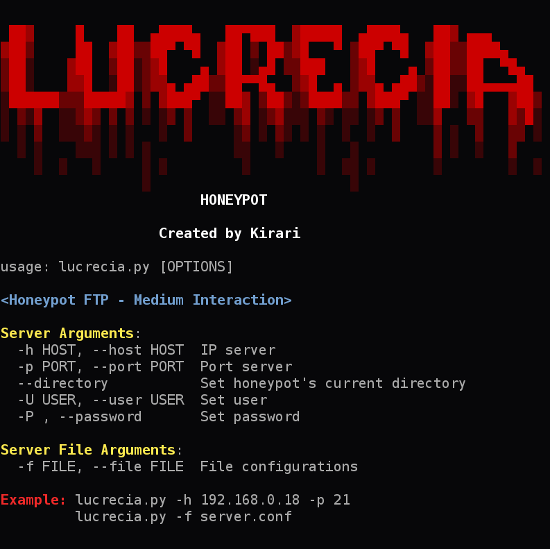

# Lucrecia
<p align="left">
    
    <br><br>
    
    <a href="https://github.com/Kirari-Senpai"></a>
    <a href="https://github.com/Kirari-Senpai?tab=repositories"></a>
    <br><br>
    
Lucrecia es un simple honeypot de media interacción para atacantes con servicio FTP.
</p>

## Clonar el repositorio ##

```
git clone https://github.com/Kirari-Senpai/Lucrecia.git
```

## Instalar dependencias ##

```
pip3 install -r requirements.txt
```

## Configurar servidor ##

Abrimos el archivo "server.conf" con el editor que les parezca más cómodo. Entonces editan como más les guste:

```

[DEFAULT]

HOST = 0.0.0.0
PORT = 5000


[FTP]

USER = kirari
PASSWORD = toor
CURRENT_DIRECTORY = /home/kirari/Server/


```

## Uso de Lucrecia Honeypot ##


