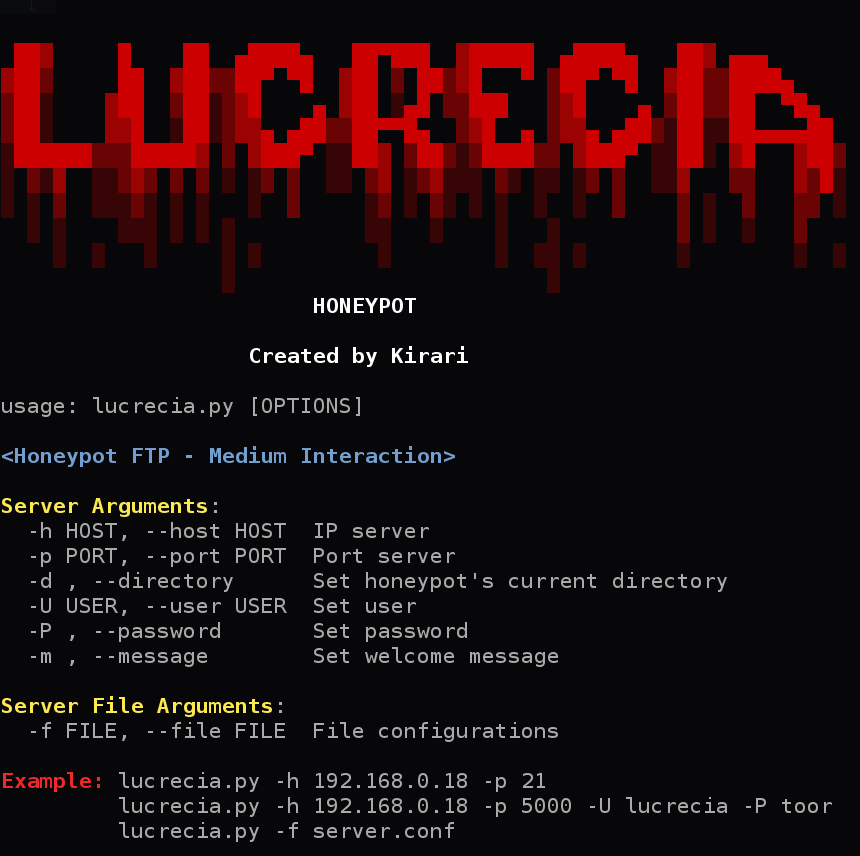

# Lucrecia
<p align="left">
    
    <br><br>
    
    <a href="https://github.com/Kirari-Senpai"></a>
    <a href="https://github.com/Kirari-Senpai?tab=repositories"></a>
    <br><br>
    
Lucrecia es un simple Honeypot FTP de media interacción desarrollada en Python.
</p>

## Clonar el repositorio ##

```
git clone https://github.com/Kirari-Senpai/Lucrecia.git
```

## Instalar dependencias ##

```
pip3 install -r requirements.txt
```

## Configurar servidor ##

Abrimos el archivo "server.conf" con el editor que les parezca más cómodo. Entonces editan como más les guste:

```

[DEFAULT]

HOST = 0.0.0.0
PORT = 5000


[FTP]

USER = lucrecia
PASSWORD = toor
CURRENT_DIRECTORY = /home/lucrecia/Server/
MSG = Welcome to Lucrecia's FTP server (vsFTPd 3.0.3)


```

## Uso de Lucrecia Honeypot ##


